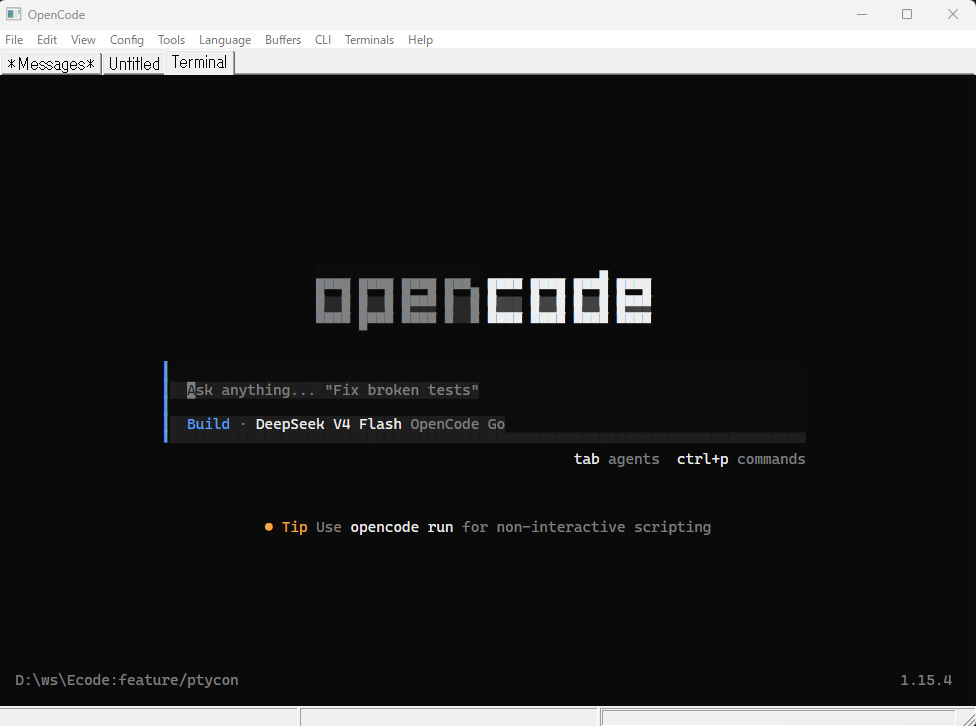

# 🚀 Ecode: High-Performance Win32 Native Text Editor


**Ecode** is a blazing-fast, native Win32 text editor with **process-bounded terminal** and **CLI command launcher** — built for developers who want a fully integrated development environment without the overhead of Electron or web-based editors.



---

## 🖥️ Process-Bounded Terminal

Ecode launches a **native Win32 terminal emulator** as a child process and binds it to the editor tab — no separate window needed.

- **Full VT420 escape sequence support**: DECSTBM scroll regions, SGR attributes, alternate screen buffer, mouse tracking, hyperlinks (OSC 8), clipboard access (OSC 52)
- **Hardware-accelerated rendering**: Direct2D + DirectWrite for sharp text at any zoom level
- **Scrollback history**: Up to 10,000 lines with visual scroll bar and scroll position indicator
- **Scroll region support**: TUI apps (vim, less, htop) keep headers/footers fixed while scrolling
- **ConPTY-based**: True pseudo-console integration via Win32 Pseudo Console API
- **Font discovery**: Cascadia Mono with Consolas fallback

```
printf '\e[5;20r'      # Set scroll region (rows 5-20)
for i in $(seq 50); do echo "Line $i"; done   # Scroll within region
Shift+PageUp           # Browse scrollback history
```

---

## ⚡ CLI Command Launcher

Define **reusable shell command entries** with configurable working directories and encoding — accessible instantly from menus or keyboard shortcuts.

- **Per-entry configuration**: Command, working directory, and encoding (UTF-8 / Shift-JIS) per entry
- **Quick execution**: Launch any entry from the CLI Entries menu or dialog
- **Batch operations**: Duplicate, edit, and reorder entries via the CLI Settings dialog
- **Integrated workflow**: Output appears in the terminal automatically

### Example use cases

| Use Case | Command | Directory |
|----------|---------|-----------|
| Build project | `cmake --build .` | `D:\ws\Ecode\build` |
| Run tests | `pytest tests/` | `D:\ws\project` |
| Git status | `git status` | `D:\ws\repo` |
| Deploy | `deploy.ps1` | `D:\ws\deploy` |

---

## ✨ Key Technical Pillars

-   **⚡ Unmatched Performance**: Leveraging a **Piece Table** data structure for $O(1)$ edit performance, even with gigabyte-sized files.
-   **💾 Huge File Support**: Instant file opening via **Win32 Memory Mapping (MMF)**. If your OS can see it, Ecode can edit it.
-   **🎨 Visual Excellence**: Hardware-accelerated text rendering using **DirectWrite** and **Direct2D** for crisp, smooth typography.
-   **📜 Extreme Programmability**: Embedded **Duktape JS Engine** allows for live macros, custom key bindings, and editor extensions.
-   **🔌 Plugin Architecture**: Modular plugin system (Dired, FastFD, Terminal, CSVEditor, JYEditor) — drop a `.exe` in `plugins/` to add new features.
-   **🌍 Multi-lingual**: Built-in support for English, Japanese, Spanish, French, and German.

---

## 🛠️ Features

### 🧩 Core Engine
*   **Piece Table Implementation**: Efficient internal representation of text edits.
*   **Atomic Save Strategy**: "Save-to-temp-and-rename" ensures zero data loss during power failures or crashes.
*   **Tabbed Interface**: Manage multiple huge buffers simultaneously with ease.

### 🔌 Plugin Ecosystem
*   **Terminal**: Full terminal emulator (ConPTY, D2D rendering, scrollback, scroll regions)
*   **Dired**: Dual-pane file manager with keyboard navigation and file operations
*   **FastFD**: Multi-pane file dialog with Direct2D rendering and directory selection
*   **CSVEditor**: Spreadsheet-style CSV viewer/editor
*   **JYEditor**: JSON/YAML tree editor
*   **FastFileSearch**: Administrator-mode NTFS file search
*   **Custom plugins**: Add your own `.exe` to `plugins/` — auto-discovered at startup

### ⌨️ Scripting & Macros
*   **Live Scratch Buffer**: Evaluate JavaScript on the fly to manipulate text or automate tasks.
*   **JS-Invokable Key Bindings**: Bind any JavaScript function to custom key chords (e.g., `Ctrl+Alt+S`).
*   **Rich JS API**: Access buffer contents, length, and editing functions directly from scripts.

### 🌐 Global Ready
*   **Multi-language UI**: Switch between English, 日本語, Español, Français, and Deutsch at runtime.
*   **UTF-8 / UCS-2 Support**: Full compatibility with modern text encodings.

---

## 🚀 Getting Started

### Prerequisites
*   Windows 10/11
*   Visual Studio 2022 (with C++ Desktop Development)
*   Powershell (for build scripts)

### Building from Source
1.  **Clone the repository**:
    ```bash
    git clone https://github.com/user/Ecode.git
    cd Ecode
    ```
2.  **Initialize environment**: Open a Developer Command Prompt.
3.  **Run Build**:
    ```powershell
    mkdir build
    cd build
    cmake ..
    cmake --build . --config Release --target installer
    ```
    This will compile the editor and generate the installer in `bin/EcodeSetup.exe`.

---

## 📖 Feature Spotlight: The Scratch Buffer

Want to automate a repetitive task? Open a **Scratch Buffer**, write some JS, and execute it instantly with `Ctrl+Enter`.

```javascript
// Duplicate the current line 10 times
function duplicate() {
  let text = Editor.getText(0, Editor.getLength());
  for(let i=0; i<10; i++) Editor.insert(Editor.getLength(), text);
}
Editor.setKeyBinding("Ctrl+D", "duplicate");
```

---

## 📈 Project Status

-   [x] Piece Table & Memory Mapping
-   [x] DirectWrite Rendering Pipeline
-   [x] Duktape Integration (JS API)
-   [x] Terminal Emulator (VT420 + ConPTY)
-   [x] CLI Command Launcher
-   [x] Plugin System (Dired, FastFD, CSVEditor, etc.)
-   [x] Localization (v1.0)
-   [ ] Caret & Selection Logic (In Progress)
-   [ ] Theming System
-   [ ] Search & Regex

---

## 📜 License
This project is licensed under the MIT License. See [LICENSE](LICENSE) for details.

---

*Built with ❤️ for the performance-obsessed developer.*
